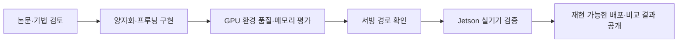
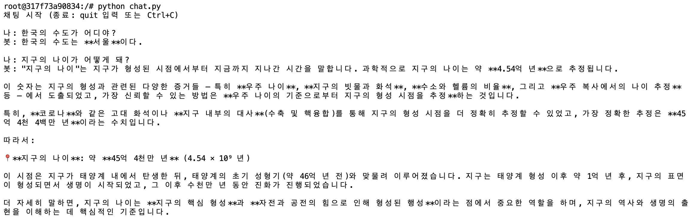

# LLM-VLM-in-Jetson

<h1 align="center">LLM & VLM 경량화 · Jetson 배포 연구</h1>

<div align="center">
<a href="https://pseudo-lab.com"></a>
<a href="https://discord.gg/EPurkHVtp2"></a>
<a href="https://github.com/Pseudo-Lab/LLM-VLM-in-Jetson/stargazers"></a>
<a href="https://github.com/Pseudo-Lab/LLM-VLM-in-Jetson/network/members"></a>
<a href="https://github.com/Pseudo-Lab/LLM-VLM-in-Jetson/pulls"></a>
<a href="https://github.com/Pseudo-Lab/LLM-VLM-in-Jetson/issues"></a>
</div>

<br>

> NVIDIA Jetson의 제한된 메모리 환경에서 LLM·VLM을 활용하기 위해 양자화와 프루닝을 실험합니다. 모델을 얼마나 줄일 수 있는지, 한국어 이해와 문서·표·차트 해석 능력이 얼마나 유지되는지 함께 평가합니다.

가짜연구소의 “함께 만드는 우연한 혁명(Serendipity Revolution)”을 바탕으로, 논문 구현부터 실험 결과와 시행착오까지 공유합니다.

**현재 상태:** 5개 기법 폴더에 구현과 문서가 정리되어 있습니다. 아래 성능 수치는 서버·데스크톱 GPU에서 보고된 결과이며, Jetson Orin Nano 8GB에서의 적재·속도·메모리 검증은 후속 과제입니다. 추가 경량화 기법은 추후 PR로 반영할 예정입니다.

## 🌟 프로젝트 목표 (Project Vision)

_“작은 디바이스에서도 활용할 수 있는 언어·비전 모델을 향해”_

- **메모리 절감:** 저비트 양자화와 구조적 프루닝으로 모델 크기와 추론 메모리 사용량을 줄입니다.
- **한국어 품질 평가:** KMMLU, 한국어 Perplexity(PPL), K-DTCBench로 경량화 전후 품질을 확인합니다.
- **기법별 재현:** 보정 데이터, 실행 설정, 평가 방법과 실패 사례를 기록합니다.
- **엣지 배포:** Jetson Orin Nano 8GB를 목표로 실행 환경과 서빙 경로를 검토합니다.
- **공동 연구:** 구현·실험·리뷰를 나누어 진행하고, 성능 보존과 압축 사이의 선택 근거를 공유합니다.

### 연구 구성

| 폴더 | 대상 모델 | 주요 접근 | 안내 |
|---|---|---|---|
| `gptq/` | Llama 3.2 11B Vision Instruct | GPTQ 4비트, NF4, 한국어 혼합 보정, 이미지 타일 축소 | [실행·결과](gptq/README.md) |
| `FOEM/` | Ministral 3 3B Instruct | GPTQ·FOEM 3/4비트, 그룹 크기·혼합 정밀도 등 설정 비교 | [사용법](FOEM/usage.md) |
| `qwen3-awq/` | Qwen3-4B 계열 | AWQ 직접 구현, 출력 오차 기반 탐색, INT4 저장·서빙 | [양자화](qwen3-awq/AWQ_USAGE.md) · [서빙](qwen3-awq/README.md) |
| `llm-streamline/` | OPT-6.7B, Llama-2-7B, Llama-3.1-8B | 연속 레이어 제거·경량 모듈 대체와 재학습 | [실행·결과](llm-streamline/README.md) |
| `shortgpt/` | Phi-4 설정 제공 | Block Influence 기반 레이어 제거; 별도 MLP 너비 프루닝 구현 | [실행·원리](shortgpt/README.md) |

## 🧑 역동적인 팀 소개 (Dynamic Team)

양자화·프루닝 구현, 한국어 평가, Jetson 배포를 함께 연구합니다. 참여자별 기여는 [Contributors](https://github.com/Pseudo-Lab/LLM-VLM-in-Jetson/graphs/contributors)와 [PR 이력](https://github.com/Pseudo-Lab/LLM-VLM-in-Jetson/pulls?q=is%3Apr+is%3Amerged)에서 확인할 수 있습니다.

- **빌더:** 연구 방향과 실험 기준을 제안하고 기법 간 결과 정리를 이끕니다.
- **러너:** 구현·재현 실험·문서화에 참여하고 코드와 결과를 상호 리뷰합니다.

팀원별 이름·역할과 정기 모임 정보는 확인 후 업데이트합니다.

## 🚀 프로젝트 로드맵 (Project Roadmap)



| 단계 | 현재 상태 |
|---|---|
| 기법 구현 | GPTQ/NF4, FOEM, AWQ, LLM Streamline, ShortGPT 코드 확보 |
| GPU 평가 | GPTQ/NF4·FOEM·AWQ·Streamline 결과 기록; ShortGPT 실모델 결과 보완 필요 |
| 서빙 | AWQ vLLM 가이드·채팅 예시, FOEM FastAPI 서빙 코드 확보 |
| Jetson 검증 | 적재 가능 여부, 응답 지연, 생성 속도와 공유 메모리 사용량 측정 필요 |
| 추가 기법 | 후속 PR 반영 예정 |

## 🛠️ 우리의 개발 문화 (Our Development Culture)

기법별 환경과 실행 과정을 각 폴더에서 관리합니다. 최상위 README는 프로젝트 개요와 결과를 안내하고, 상세 설정·로그 해석은 해당 실험 문서에 기록합니다.

```text
LLM-VLM-in-Jetson/
├── README.md              # 프로젝트 소개·결과 요약
├── gptq/                  # GPTQ/NF4, VLM 평가, Jetson 측정 스크립트
├── FOEM/                  # 양자화·평가·설정별 보고서·서빙
├── qwen3-awq/             # AWQ 구현과 vLLM 서빙 가이드
├── llm-streamline/        # 레이어 탐색·대체·재학습·KMMLU 평가
└── shortgpt/              # 깊이/너비 프루닝·평가·테스트
```

### 시작하기

```bash
git clone --branch develop https://github.com/Pseudo-Lab/LLM-VLM-in-Jetson.git
cd LLM-VLM-in-Jetson
```

1. 위 연구 구성 표에서 사용할 기법의 안내 문서를 엽니다.
2. 해당 폴더의 요구사항에 맞춰 **별도 Python 환경**과 CUDA 패키지를 준비합니다.
3. 원본 모델 접근 권한과 다운로드 경로를 확인한 뒤 양자화 또는 프루닝을 실행합니다.
4. 원본·경량 모델을 같은 평가 조건으로 비교하고 설정과 결과를 함께 기록합니다.

모델 가중치는 저장소에 포함하지 않습니다. FOEM 산출물 폴더에는 설정·보고서 등이 있으며, 사용하려면 가중치를 별도로 준비하거나 양자화를 실행해야 합니다. 일부 스크립트의 로컬 경로는 실행 환경에 맞게 수정해야 합니다. Jetson은 JetPack·aarch64에 맞는 환경 준비가 별도로 필요합니다.

### 실험 기록과 리뷰

- PR에는 대상 모델, 변경 내용, 실행 조건과 결과 출처를 함께 남깁니다.
- 성능 표에는 하드웨어, 보정 데이터, 비트 수, 평가셋, few-shot·채점 방식을 명시합니다.
- **실측 결과·추정치·향후 계획**을 구분하고, 성능이 악화된 설정도 공유합니다.
- 빌더와 러너가 구현 및 결과 해석을 함께 리뷰합니다.

## 📈 성과 지표 (Achievement Metrics)

아래는 저장소에 기록된 실험 결과입니다. **모델·환경·채점 방식이 달라 기법 간 순위표로 해석할 수 없습니다.** 각 표에서 같은 모델의 경량화 전후 변화를 확인하세요. 정확도 차이는 퍼센트포인트(%p)이며, PPL은 낮을수록 좋습니다.

### 1. Llama 3.2 11B Vision — GPTQ / NF4

환경: NVIDIA RTX 3080 Ti 12GB, 시스템 RAM 64GB. GPTQ는 한국어/영어 70:30 보정 데이터를 사용합니다. K-DTCBench는 240문항에서 생성한 답변의 선택지를 추출해 채점합니다.

| 구성 | 한국어 PPL ↓ | K-DTCBench ↑ | 메모리 |
|---|---:|---:|---|
| 원본 FP16 | 8.57 | 29.2% | 약 22GB¹ |
| GPTQ 4비트 | 9.14 | 30.4% | Peak VRAM 약 11GB |
| NF4 전체 4비트 | 9.23 | 37.9% | Peak VRAM 8.15GB |
| NF4 + `lm_head` 4비트 + 타일 2 | 9.33 | 32.5% | **Peak VRAM 6.88GB** |

¹ 원본 11B FP16의 약 22GB는 모델 적재 규모를 나타내며, 12GB GPU 단독 적재 실측으로 해석하지 않습니다.

비전 부분까지 양자화하고 이미지 타일 수를 줄여 메모리를 추가 절감했습니다. 다만 정확도 상승을 일반적인 품질 향상으로 단정할 수 없으며, **6.88GB는 Jetson 적재 성공을 뜻하지 않습니다.**

출처: [GPTQ/NF4 결과와 실행 방법](gptq/README.md) · [Jetson 이식 계획](gptq/scripts/jetson/README.md)

### 2. Ministral 3 3B — GPTQ / FOEM

환경: NVIDIA RTX 5070 12GB. KMMLU는 45과목·35,030문항·5-shot의 문항 기준 평균(micro)이며, K-DTCBench는 240문항·zero-shot에서 선택지 토큰 확률로 채점합니다.

| 구성 | KMMLU ↑ | K-DTCBench ↑ |
|---|---:|---:|
| 원본 BF16 | **46.88%** | 62.08% |
| GPTQ 4비트 | 44.19% | 60.83% |
| FOEM 3비트, 그룹 크기 128 | 35.58% | 50.83% |
| FOEM 3비트, 그룹 크기 32 | 미보고 | 53.33% |
| FOEM 4비트 | 미보고 | **62.50%** |

FOEM 3비트에서 그룹 크기를 128→32로 줄이면 WikiText-2 PPL은 **10.87→9.85**, 모델 파일 크기는 **2.840→3.008GB**로 변했습니다. K-DTCBench는 **2.50%p** 회복했습니다. FOEM 4비트의 62.50%는 원본보다 1문항 높은 값으로, 우월성을 확정하는 근거는 아닙니다.

GPTQ 4비트와 FOEM 3비트의 차이에는 비트 수의 영향도 포함됩니다. 같은 비트 조건과 모델 구성을 맞춘 비교가 필요합니다.

출처: [KMMLU 보고서](FOEM/pseudo/KMMLU_REPORT.md) · [K-DTCBench 보고서](FOEM/pseudo/KDTCBENCH_REPORT.md) · [설정별 실험](FOEM/pseudo/ABLATION_REPORT.md) · [FOEM 4비트 결과](FOEM/Ministral-3-3B-Instruct-2512-BF16_foem_4bit/README.md)

### 3. Qwen3-4B — 직접 구현 AWQ

RunPod 환경에서 기록한 KMMLU 결과입니다. 직접 구현은 한국어 Wikipedia 보정 데이터(`kowikitext` 옵션), 출력 오차 탐색, clipping 비활성 설정을 사용합니다. 공식 AutoAWQ 결과는 영어 `pileval` 보정이므로 구현과 데이터의 차이를 함께 고려해야 합니다.

| 구성 | KMMLU ↑ | 문서에 보고된 모델 크기 |
|---|---:|---:|
| FP16 기준 모델 | 45.81% | 8.04GB |
| 공식 AutoAWQ INT4 | 44.11% | 미보고 |
| 직접 구현 AWQ INT4 | **42.98%** | **2.67GB** |

직접 구현은 FP16 대비 **약 3배 압축**, 정확도 **2.83%p 감소**를 기록했습니다. 탐색 기준을 가중치 오차에서 출력 오차로 바꿔 **41.73→42.98%**로 개선했습니다. Scale folding은 후속 개선 항목입니다.

성능 보고서는 Qwen3-4B 기준이며, 서빙 가이드는 Instruct 계열 공개 모델을 사용합니다. 실행할 체크포인트와 평가 조건을 확인하세요.

출처: [구현 원리·실험 결과](qwen3-awq/DESIGN_NOTES.md) · [서빙·채팅 가이드](qwen3-awq/README.md)

<details>
<summary>AWQ 채팅 실행 예시</summary>



</details>

### 4. LLM Streamline — 레이어 대체와 재학습

환경: NVIDIA HGX A100 80GB. KMMLU 점수는 과목별 정확도의 평균(macro)입니다. OPT는 1-shot, Llama는 5-shot으로 평가했습니다.

| 모델·구성 | 파라미터 수 | KMMLU 평균 ↑ |
|---|---:|---:|
| OPT-6.7B 원본 | 6.66B | 27.58% |
| OPT — 8개 레이어 제거 | 5.05B | 19.13% |
| OPT — MLP로 대체·재학습 | 5.18B | 25.53% |
| OPT — Transformer로 대체·재학습 | **5.25B** | **26.41%** |
| Llama-3.1-8B 원본 | 8.03B | 40.89% |
| Llama-3.1 — 공개 경량 모델 재평가 | 5.41B | 42.41% |
| Llama-2-7B 원본 | 6.74B | 19.79% |
| Llama-2 — 공개 경량 모델 재평가 | 4.71B | 24.03% |

OPT 실험에서는 단순 제거보다 경량 모듈 대체·재학습이 품질을 더 잘 보존했습니다. **Llama 결과는 논문 저자가 공개한 경량 모델을 재사용한 평가**이며, 이 저장소에서 직접 재학습한 OPT 실험과 구분합니다.

출처: [구현·학습·평가 설명](llm-streamline/README.md)

### 5. ShortGPT — 구현 및 검증 범위

레이어 입력·출력의 코사인 유사도로 Block Influence를 측정하고, 영향이 낮은 레이어를 제거합니다. Phi-4 설정은 레이어 제거 비율 30%를 사용하며, 별도 스크립트에서 MLP 너비 프루닝도 지원합니다.

- 깊이 프루닝: [`run_depth_prune.py`](shortgpt/scripts/run_depth_prune.py)
- 너비 프루닝: [`run_prune.py`](shortgpt/scripts/run_prune.py)
- 품질 비교: [`eval_compare.py`](shortgpt/scripts/eval_compare.py)
- 검증 코드: [`tests/`](shortgpt/tests/)

현재 저장소에는 실모델 성능 결과가 보고되어 있지 않습니다. 실행 보고서의 **4비트 메모리는 파라미터 수 기반 추정치**이며, 프루닝 스크립트가 실제 4비트 양자화나 Jetson 측정을 수행하는 것은 아닙니다. Distillation·GGUF 배포 완료도 의미하지 않습니다.

### 결과 해석과 후속 측정

- PPL 개선이 한국어 지식·시각 추론 개선과 항상 일치하지 않아 여러 지표를 함께 봅니다.
- 파일 크기, 모델 적재 메모리, Peak VRAM, Jetson 공유 메모리는 서로 다른 지표입니다. 보고서별 GB/GiB 표기도 측정 코드와 함께 확인해야 합니다.
- Jetson에서는 동일한 입력 길이·이미지 해상도·생성 길이 조건으로 적재 성공, 응답 지연, tokens/s와 시스템 메모리를 측정할 예정입니다.

## 💻 주요 활동 (Activity History)

기법별 진행 내용과 산출물을 정리합니다. 세부 주차·발표 일정은 확인 후 추가합니다.

| 활동 | 산출물 |
|---|---|
| 양자화 방식과 한국어 보정 데이터 검토 | [GPTQ 기법 선정](gptq/docs/quantization_method_selection.md), [한국어 혼합 보정 설계](gptq/docs/superpowers/specs/2026-06-23-korean-calibration-requant-design.md) |
| 양자화 설정별 품질 분석 | [FOEM 설정별 실험 보고서](FOEM/pseudo/ABLATION_REPORT.md) |
| AWQ 구현·출력 오차 탐색·서빙 | [AWQ 설계 기록](qwen3-awq/DESIGN_NOTES.md), [채팅 예시](qwen3-awq/README.md) |
| 프루닝·대체 모듈 학습과 평가 | [LLM Streamline](llm-streamline/README.md), [ShortGPT](shortgpt/README.md) |
| Jetson 측정 준비 | [이식 계획](gptq/scripts/jetson/README.md), [측정 스크립트](gptq/scripts/jetson/bench_jetson.py) |

## 💡 학습 자원 (Learning Resources)

- **양자화 실험:** [GPTQ/NF4](gptq/README.md), [FOEM 사용법](FOEM/usage.md), [AWQ 사용법](qwen3-awq/AWQ_USAGE.md)
- **프루닝 실험:** [LLM Streamline](llm-streamline/README.md), [ShortGPT](shortgpt/README.md)
- **한국어 평가:** [KMMLU 비교 보고서](FOEM/pseudo/KMMLU_REPORT.md), [문서·표·차트 평가 보고서](FOEM/pseudo/KDTCBENCH_REPORT.md)
- **실험 시각화:** [GPTQ 결과 자료](gptq/results/)

## 🌱 참여 안내 (How to Engage)

- **빌더로 참여:** 연구 질문, 실험 기준과 배포 방향을 제안합니다.
- **러너로 참여:** 기법 구현, 재현 실험, 결과 검토와 문서 개선에 함께합니다.
- **질문·제안:** [GitHub Issues](https://github.com/Pseudo-Lab/LLM-VLM-in-Jetson/issues)와 [가짜연구소 Discord](https://discord.gg/EPurkHVtp2)를 이용하세요.
- **기여:** `develop`을 기준으로 작업하고 변경 사항과 검증 결과를 PR로 공유해주세요.

## Acknowledgement 🙏

이 프로젝트는 가짜연구소 Open Academy의 협업과 지식 공유를 바탕으로 진행됩니다. 모델·데이터셋·경량화 도구를 공개한 연구자와 오픈소스 커뮤니티, 구현과 실험을 함께한 모든 기여자에게 감사드립니다.

## About Pseudo Lab 👋🏼

[가짜연구소(Pseudo-Lab)](https://pseudo-lab.com/)는 Sharing, Motivation, Collaborative Joy의 가치를 바탕으로 머신러닝·AI 연구와 오픈소스 지식 공유를 함께하는 비영리 커뮤니티입니다.

## Contributors 😃

<a href="https://github.com/Pseudo-Lab/LLM-VLM-in-Jetson/graphs/contributors">
  
</a>

## License 🗞

현재 저장소에는 별도 `LICENSE` 파일이 없습니다. 저장소 코드의 라이선스 명시는 후속 정리 항목이며, 원본 모델·데이터셋·참조 구현을 사용할 때는 각 배포처의 라이선스와 이용 조건을 확인해주세요.
